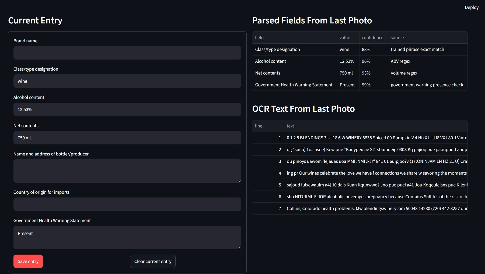

# AB Identify

AB Identify is webapp tool for reading alcohol label photos and building an alcohol compliance table. Users upload one label image at a time; OCR reads the visible text, the field parser fills high-confidence values, and the user can edit or delete fields in the entry before saving it to an in-memory table.

## Docker Guide: CUDA

Use this path when running on a machine with NVIDIA GPU support configured for Docker Desktop.

```powershell
cd C:\ab_proj\AB_identify
docker compose -f docker-compose.yml -f docker-compose.gpu.yml up --build
```

Then open http://localhost:8501.

The GPU compose override exposes all NVIDIA GPUs to the container and requests:

```text
OCR_BACKEND=easyocr
OCR_DEVICE=cuda
```

The app still checks PyTorch CUDA availability at runtime. If CUDA is not visible inside the container, OCR falls back according to the configured backend behavior.

## Docker Guide: CPU

Use this path for cpu only compatibility.

```powershell
cd C:\ab_proj\AB_identify
docker compose up --build
```

Then open http://localhost:8501.

The CPU build runs the same web app and parser artifact, but OCR inference will be antiquated due to cpu inference.

## Python Guide

For local development without Docker:

```powershell
cd C:\ab_proj\AB_identify
py -m venv .venv
.\.venv\Scripts\Activate.ps1
python -m pip install --upgrade pip
pip install -r requirements.txt
python -m streamlit run app.py
```

Training data is materialized separately from colacloud.us and is not required for normal inference if `weights/cola_field_parser.json` is present.

```powershell
python materialize_cola_sample.py
python train.py --train-ratio 0.9 --min-confidence 0.85
```

## App Layers

The app uses two AI layers rather than one monolithic model.

```text
label image -> pretrained OCR -> OCR text -> trained field parser -> editable table
```

**OCR layer:** EasyOCR is the preferred pretrained OCR backend, with Tesseract available as a fallback. A pretrained OCR is used due to time constraints.

**Field parser layer:** `weights/cola_field_parser.json` is trained from COLA Cloud's OCR text dataset. It parses the OCR text from the current upload and fills only values that clear the confidence rules.

## Parsed Fields

The app tracks seven fields:

- Brand name
- Class/type designation
- Alcohol content
- Net contents
- Name and address of bottler/producer
- Country of origin for imports
- Government Health Warning Statement

Users can upload multiple photos for the same product one at a time. Newly parsed values fill only blank fields, so prior OCR results and user edits stick until `Save entry`. Saved entries are stored in an in-memory pandas table and are cleared when the app reinitializes.

'Government warning' is treated as a presence check. The parser stores `Present` when OCR contains tolerant variants of "Government Warning"

Country of origin is trained from imported COLA records using `ORIGIN_NAME` and also checked against recognized country names in OCR text.





## Assumptions

- The Docker image is inference-first. Training should happen before Docker deployment, and the exported parser artifact should be present at `weights/cola_field_parser.json`.
- The current project uses pretrained OCR rather than training a custom OCR detector/recognizer from scratch.
- The available training data includes full label images, OCR text, and COLA-level structured fields, but not labeled bounding boxes for OCR training.
- Parser confidence is intentionally conservative. Blank fields are preferred over low-confidence guesses.
- The saved-entry table is temporary by design and resets when the app process restarts.

## Tools And Data

- Streamlit: web UI
- pandas: in-memory saved-entry table
- EasyOCR: primary pretrained OCR CUDA layer
- Tesseract / pytesseract: OCR CPU fallback
- PyTorch: EasyOCR runtime and CUDA detection
- Pillow / OpenCV / NumPy: image handling
- Docker Compose: CPU and CUDA deployment paths
- COLA Cloud sample pack: training source for label images, OCR text, imported country data, and structured COLA fields

COLA Cloud references in the sample pack:

- Docs: https://docs.colacloud.us
- Dashboard: https://app.colacloud.us
- Image CDN pattern: `https://dyuie4zgfxmt6.cloudfront.net/{TTB_IMAGE_ID}.webp`

## Live Demo

reachable at:
https://abapp.donutclickonme.com/